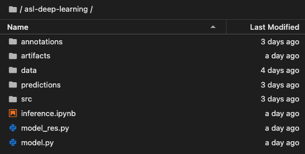
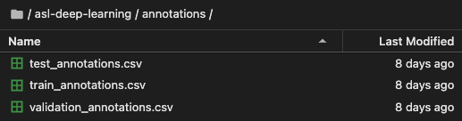
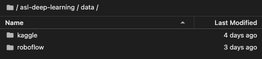
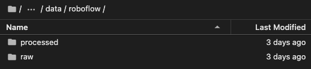
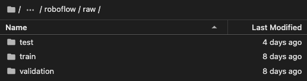
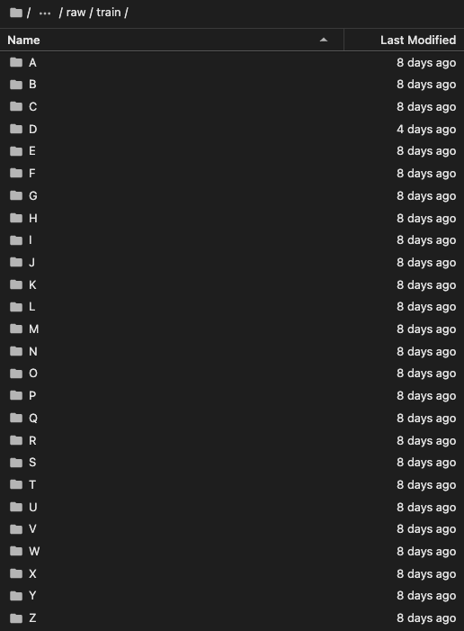

# ASL Object Detection Challenger Model

## Directory Structure in Deepdish

- Root

- Annotations

- Data

- Roboflow

- Raw
    - The processed directory has the same structure as below but contains images that are trimmed based on the bounding box coordinates before training the model. 

- Train 
    - The validation directory has the same structure as train
    - The test directory **doesn't** contain subdirectories like train and validation and instead only contains the images.

